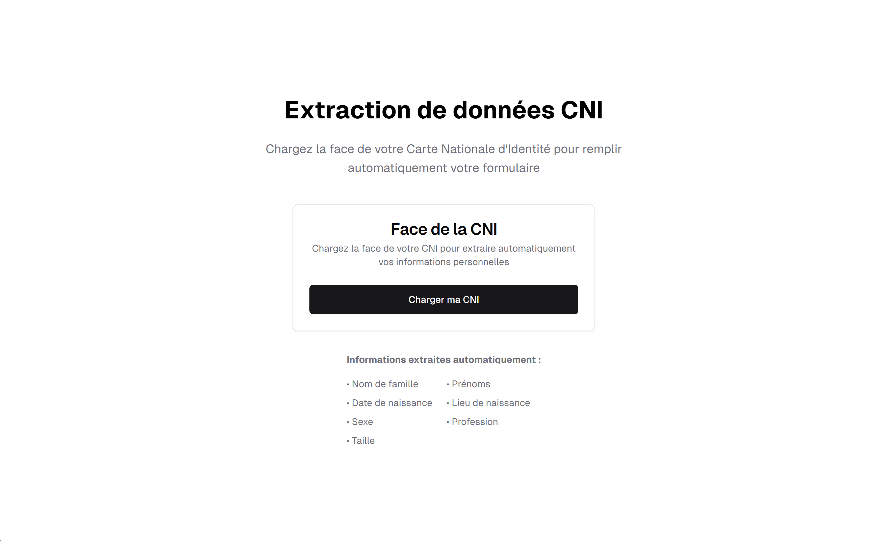
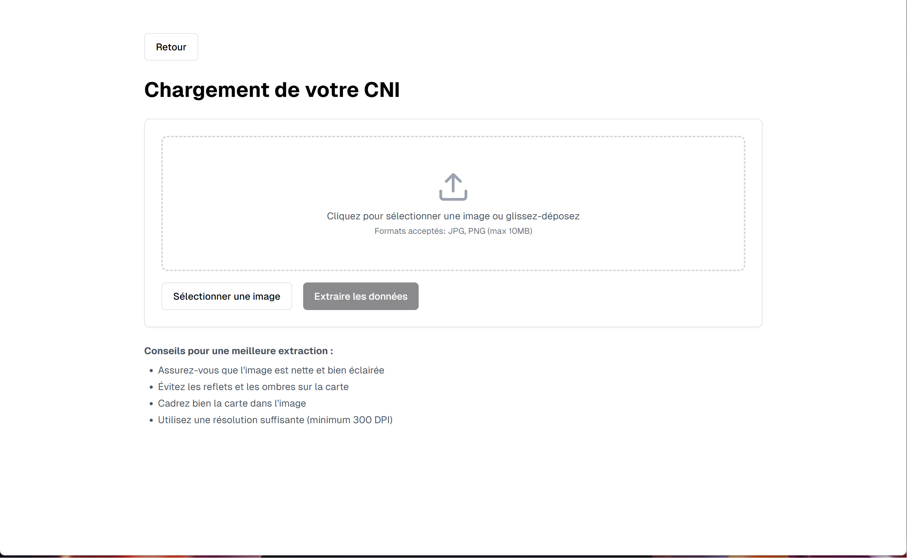
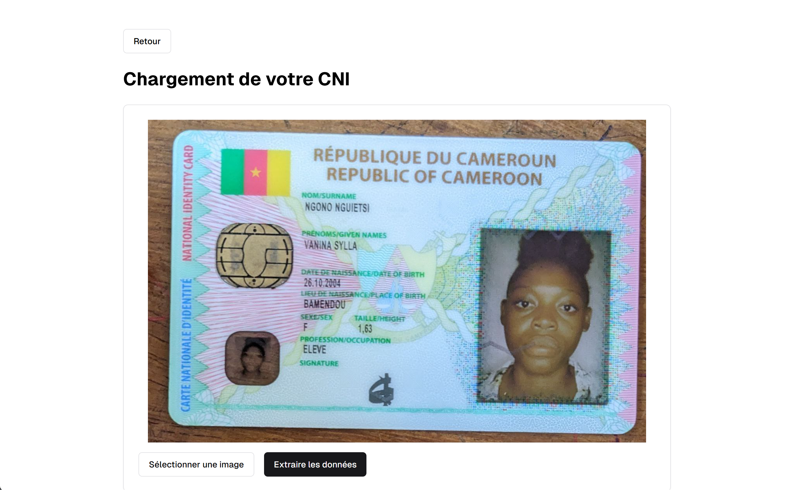

# Documentation Technique du Projet OCR pour CNI Camerounaise

## 1. Introduction

Ce projet a pour objectif de développer un système OCR (Optical Character Recognition) capable d'extraire automatiquement les informations textuelles de la première face de la Carte Nationale d'Identité (CNI) camerounaise. Les données extraites servent à pré-remplir un formulaire numérique qui sera ensuite validé par l'utilisateur.

## 2. Architecture du Système

### 2.1. Composants principaux

1. **API Flask**: Serveur backend qui reçoit les images et retourne les données structurées
2. **EasyOCR**: Moteur de reconnaissance optique de caractères
3. **Module de traitement**: Logique de transformation du texte brut en données structurées
4. **Interface client**: Application frontend (non couverte dans cette documentation)

### 2.2. Schéma d'architecture

```
[Client] --> (Image CNI) --> [API Flask] --> [EasyOCR] 
    ^                                      |
    |                                      v
    |-- (JSON structuré) <-- [Module de traitement]
```

## 3. Spécifications Techniques

### 3.1. API Endpoints

#### POST `/extract-cni`

- **Description**: Endpoint principal pour l'extraction des informations
- **Paramètres**:
  - `file`: Fichier image de la CNI (formats acceptés: JPG, PNG, JPEG)
- **Réponses**:
  - 201: Succès, retourne les données extraites en JSON
  - 400: Erreur de requête (fichier manquant ou type non supporté)
  - 500: Erreur serveur lors du traitement

### 3.2. Format de sortie

```json
{
    "surname": "NGONO NGUIETSI",
    "given_names": "VANINA SYLLA",
    "date_of_birth": "26.10.2004",
    "place_of_birth": "BAMENDOU",
    "sex": "F",
    "height": "1,63",
    "profession": "ELEVE"
}
```

## 4. Implémentation

### 4.1. Fichier principal (api.py)

```python
from flask import Flask, request, jsonify
from werkzeug.utils import secure_filename
from utils.utils_ocr import extract_cni_info
from flask_cors import CORS
import easyocr
import os

# Initialisation de l'application Flask
app = Flask(__name__)
CORS(app)  # Activation des CORS pour les requêtes cross-origin

# Configuration
UPLOAD_FOLDER = './temp_uploads'
ALLOWED_EXTENSIONS = {'png', 'jpg', 'jpeg'}
app.config['UPLOAD_FOLDER'] = UPLOAD_FOLDER

# Création du répertoire de stockage temporaire
os.makedirs(UPLOAD_FOLDER, exist_ok=True)

# Initialisation du lecteur EasyOCR
reader = easyocr.Reader(['fr', 'en'], gpu=False)

def allowed_file(filename):
    """Vérifie si l'extension du fichier est autorisée"""
    return '.' in filename and filename.rsplit('.', 1)[1].lower() in ALLOWED_EXTENSIONS

@app.route('/extract-cni', methods=['POST'])
def extract_cni():
    # Vérification de la présence du fichier
    if 'file' not in request.files:
        return jsonify({"error": "Aucun fichier fourni"}), 400
    
    file = request.files['file']
    
    # Vérification du nom de fichier
    if file.filename == '':
        return jsonify({"error": "Aucun fichier sélectionné"}), 400
    
    if file and allowed_file(file.filename):
        filename = secure_filename(file.filename)
        filepath = os.path.join(app.config['UPLOAD_FOLDER'], filename)
        file.save(filepath)
        
        try:
            # Lecture du texte avec EasyOCR
            results = reader.readtext(filepath)
            
            # Extraction des informations structurées
            cni_data = extract_cni_info(results)
            
            # Nettoyage du fichier temporaire
            os.remove(filepath)
            
            return jsonify(cni_data), 201
            
        except Exception as e:
            return jsonify({"error": f"Erreur lors du traitement: {str(e)}"}), 500
    
    return jsonify({"error": "Type de fichier non autorisé"}), 400

if __name__ == '__main__':
    app.run(debug=True, host='0.0.0.0', port=5000)
```

### 4.2. Module de traitement (utils/utils_ocr.py)

```python
import re

def extract_cni_info(text_results):
    """
    Transforme les résultats bruts d'OCR en données structurées de la CNI
    
    Args:
        text_results: Résultats de la reconnaissance OCR (liste de tuples)
        
    Returns:
        Dictionnaire contenant les informations extraites de la CNI
    """
    data = {
        "surname": "",
        "given_names": "",
        "date_of_birth": "",
        "place_of_birth": "",
        "sex": "",
        "height": "",
        "profession": ""
    }
    
    current_field = None  # Suivi du champ en cours de traitement
    
    for (_, text, _) in text_results:
        text = text.strip()
        
        # Détection des libellés de champs
        if "NOM/SURNAME" in text or "NoMSURNAME" in text:
            current_field = "surname"
            continue
        elif "PRÉNOMS/GIVEN" in text or "PREnOMSiGIVEN" in text:
            current_field = "given_names"
            continue
        elif "DATE DE NAISSANCE" in text or "DATEPEaNCEDareofeth" in text:
            current_field = "date_of_birth"
            continue
        elif "LIEU DE NAISSANCE" in text or "LFuEE" in text:
            current_field = "place_of_birth"
            continue
        elif "SEXE/SEX" in text or "S8ssex" in text:
            current_field = "sex"
            continue
        elif "TAILLE/MERGHT" in text or "TailLE Hesser" in text:
            current_field = "height"
            continue
        elif "PROFESSION/OCCUPATION" in text or "PROFESSIONOCCUPATION" in text:
            current_field = "profession"
            continue
            
        # Extraction des valeurs selon le champ courant
        if current_field == "surname" and not data["surname"]:
            clean_name = re.sub(r'[^a-zA-Z\s]', '', text)
            data["surname"] = clean_name.strip()
        elif current_field == "given_names" and not data["given_names"]:
            clean_name = re.sub(r'[^a-zA-Z\s]', '', text)
            data["given_names"] = clean_name.strip()
        elif current_field == "date_of_birth" and not data["date_of_birth"]:
            date_match = re.search(r'\d{1,2}[.,/]\d{1,2}[.,/]\d{2,4}', text)
            if date_match:
                data["date_of_birth"] = date_match.group().replace(',', '.').replace('/', '.')
        elif current_field == "place_of_birth" and not data["place_of_birth"]:
            if text.isupper() and len(text) > 3:
                data["place_of_birth"] = text
        elif current_field == "sex" and not data["sex"]:
            if text.upper() in ['F', 'M']:
                data["sex"] = text.upper()
        elif current_field == "height" and not data["height"]:
            height_match = re.search(r'\d,\d{2}', text)
            if height_match:
                data["height"] = height_match.group()
        elif current_field == "profession" and not data["profession"]:
            if text.isupper() and len(text) > 2:
                data["profession"] = text
    
    return data
```

## 5. Dépendances

Liste des packages Python requis (requirements.txt):

```
flask==2.0.1
flask-cors==3.0.10
easyocr==1.4.1
torch
torchvision
python-dotenv
werkzeug==2.0.1
```

## 6. Installation et Exécution

1. **Cloner le dépôt**:
   ```bash
   git clone https://github.com/nullhq/ocr-cni
   cd ocr-cni
   ```

2. **Créer un environnement virtuel**:
   ```bash
   python -m venv venv
   source venv/bin/activate  # Linux/Mac
   venv\Scripts\activate  # Windows
   ```

3. **Installer les dépendances**:
   ```bash
   pip install -r requirements.txt
   ```

4. **Lancer l'API**:
   ```bash
   python api.py
   ```

5. **Tester l'API**:
   ```bash
   curl -X POST -F "file=@chemin/vers/image.jpg" http://127.0.0.1:5000/extract-cni
   ```

## 7. Tests et Validation

### 7.1. Cas de test

1. **Image valide**:
   - Envoi d'une image claire de CNI
   - Vérification que tous les champs sont correctement extraits

2. **Image non valide**:
   - Envoi d'une image non-CNI
   - Vérification du message d'erreur approprié

3. **Fichier non image**:
   - Envoi d'un fichier PDF/text
   - Vérification du rejet du fichier

### 7.2. Métriques

- Temps de réponse moyen: 5-10 secondes par image

## 8. Limitations et Améliorations Possibles

### 8.1. Limitations actuelles

1. Sensible à la qualité de l'image
2. Format fixe pour les CNI camerounaises uniquement
3. Dépendance à EasyOCR pour la reconnaissance de texte

### 8.2. Améliorations futures

1. Ajout d'un module de validation des données
2. Intégration avec une base de données
3. Interface utilisateur web/mobile
4. Amélioration de la précision avec un modèle custom

### 9. Prévisualisation de l'interface utilisateur
#### 9.1 Interface d'acceuil

#### 9.2 Interface de chargement de la CNI

#### 9.3 Interface avec la CNI déja chargé



## 10. Conclusion

Ce système fournit une solution fonctionnelle pour l'extraction automatique des informations des CNI camerounaises. L'architecture modulaire permet des améliorations futures et l'intégration avec d'autres systèmes. Le projet démontre l'application pratique des technologies OCR dans le traitement de documents d'identité.

---

**ANNEXES**  
1. Exemples d'images de CNI Camerounaises
2. Résultats de tests détaillés  
3. Captures d'écran de l'interface (si disponible)